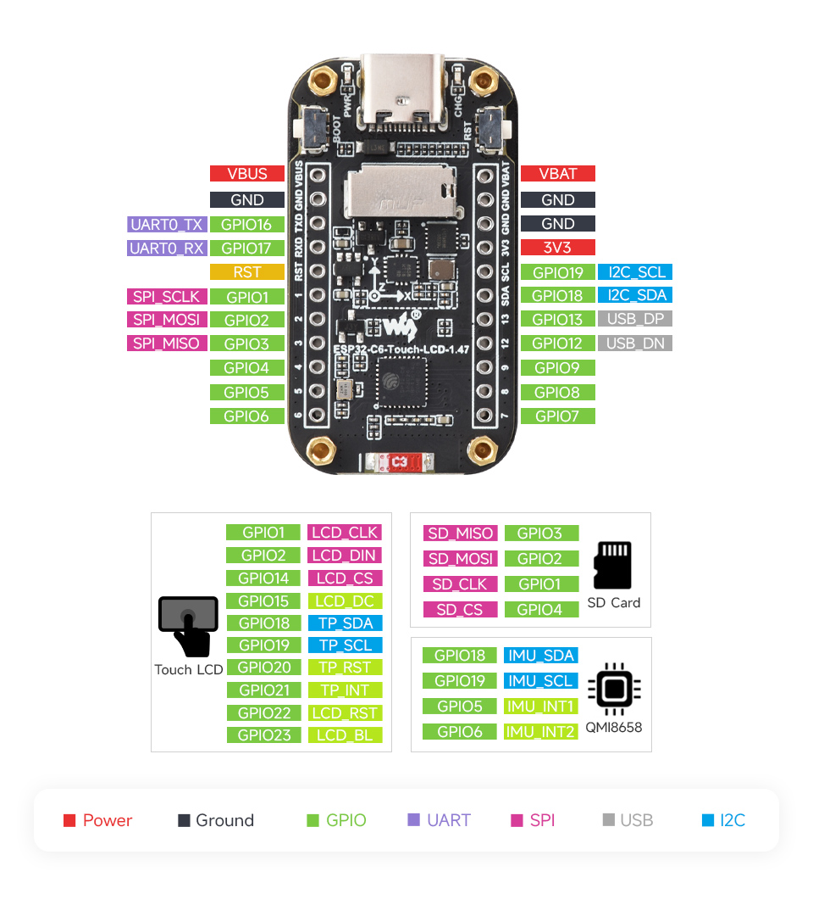

# Hardware information

## Board pinout

## Documents

- [Board schematic](../files/ESP32-C6-Touch-LCD-1.47-Schematic.pdf)
- [ESP32-C6 datasheet](../files/ESP32-C6_Series_Datasheet.pdf)

## Links

- [ Embedded Rust (no_std) on Espressif book][1]
- [`esp_hal` crate documentation][2]
- [ESP32-C6 Development Board][3]

[1]: https://docs.espressif.com/projects/rust/no_std-training/01_intro.html
[2]: https://docs.espressif.com/projects/rust/esp-hal/1.0.0-rc.0/esp32c6/esp_hal/index.html
[3]: https://www.waveshare.com/esp32-c6-touch-lcd-1.47.htm
